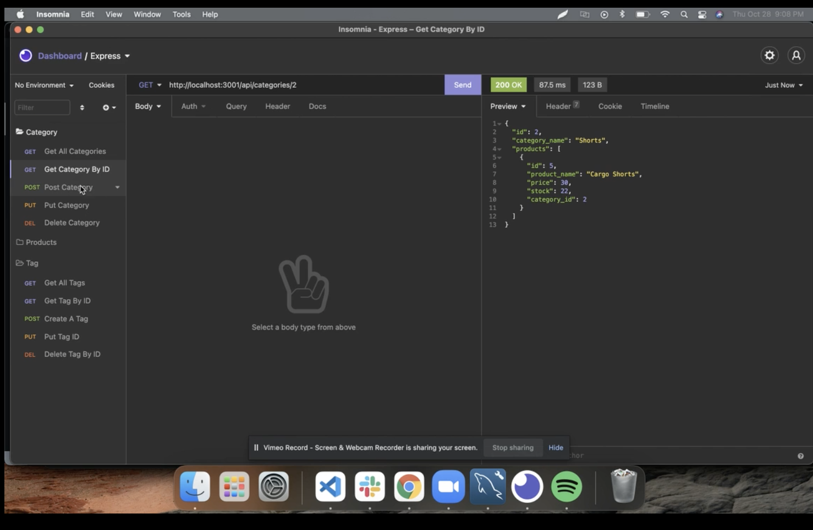
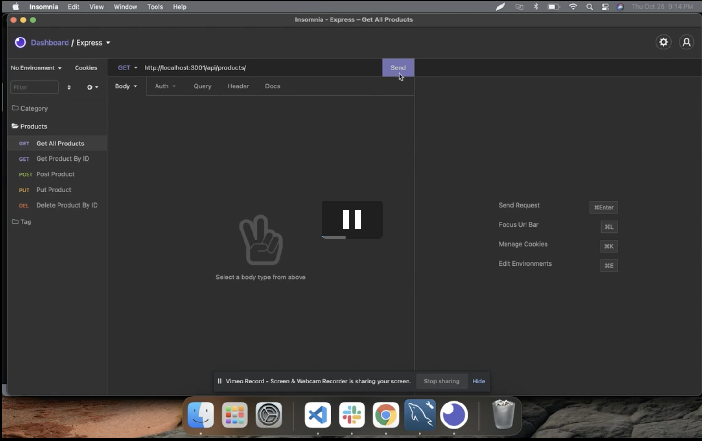
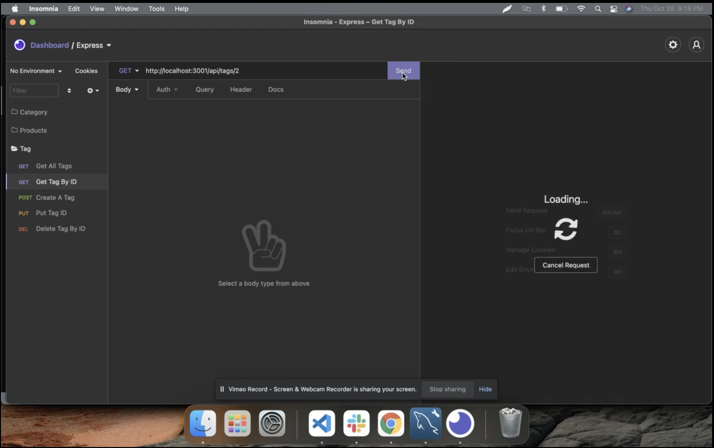

# HOMEWORK13_ORM_E-COMMERCE

# ORM - E-Commerce

## Description: 
 The purpose of this project was build a back end for an e-commerce site with use of CRUD. This includes Express.js API and Sequelize to interact with a MySQL database.

## Table of Contents 

* [Installation](#installation)
* [Usage](#usage)
* [Contributors](#contributors)
* [License](#license)
  
## Installation 
This is an assignment has no front-end and requires the use of postman or insomnia.

## Usage 
Click on each image below to view the videos

## Contributors 
TA , AskBCS , Study Group

## Testing 
No test cases available

## License 
MIT 

## Questions: 
If you have any questions, please feel free to contact me at:
  Email Address: christa.baccas@gmail.com
  Github Account: https://github.com/christa-baccas

